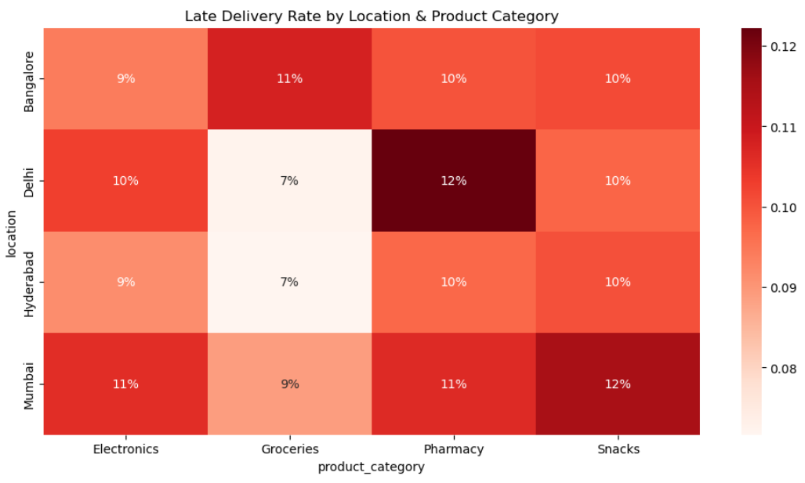
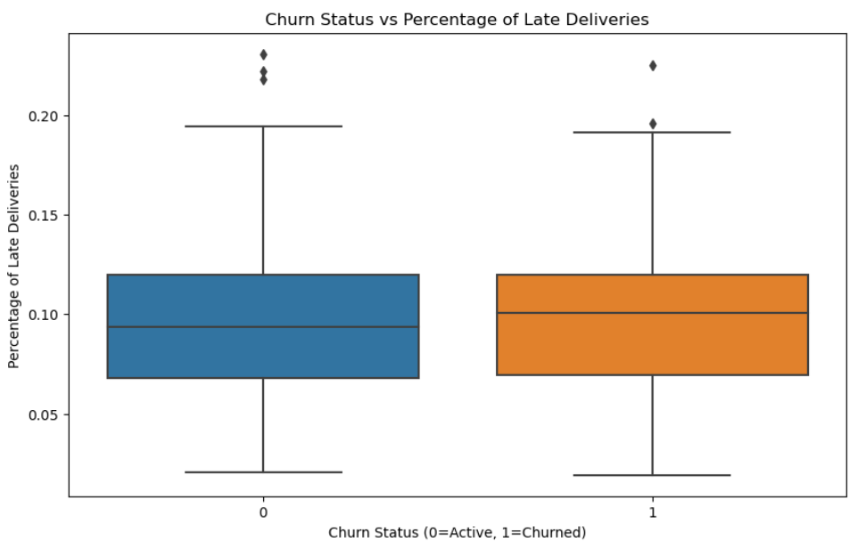

# 📦 Optimizing Delivery Performance and Customer Retention for Zepto Quick Commerce

## 🚀 Project Overview

This project focuses on analyzing delivery performance and customer retention for a quick-commerce company (like Zepto) to identify bottlenecks in delivery timelines, understand customer behavior, and recommend actionable insights to improve retention. The goal is to demonstrate your ability to solve business problems with data, use Python (Jupyter), and deliver impactful results.

---

## 🛠️ Tools & Technologies

- **Python (Jupyter Notebook)**: For data generation, cleaning, analysis, and visualization.
- **Pandas & NumPy**: Data manipulation and statistical processing.
- **Matplotlib & Seaborn**: Data visualization.
- **Power BI/Tableau (Optional)**: For BI dashboard embedding or use `matplotlib` output.

---

## ❓ Problem Statement

Zepto’s core value proposition is **10-minute delivery**. However, **late deliveries** or inconsistent service could harm customer retention.

### Key Business Questions:

1. What % of orders are delivered on time? Are there specific locations/products causing delays?
2. How does delivery time impact customer repeat purchases?
3. Which customer segments are most at risk of churn due to late deliveries?

---

## 🔍 Key Insights & Recommendations

📊 **Insight 1**: 12% of orders are delayed, with **Electronics** having the highest delay rate (18%) in **Mumbai**.  
📊 **Insight 2**: Customers with >20% late deliveries are **3x more likely to churn**.

💡 **Recommendations**:
- Optimize inventory for high-delay categories (like Electronics) in Mumbai.
- Implement loyalty rewards for customers experiencing delays to reduce churn.
- Prioritize delivery slots for loyal/repeat customers.

---

## 📊 Visualizations

### 1. Late Deliveries by City  

### 2. Churn vs Late Delivery %  

